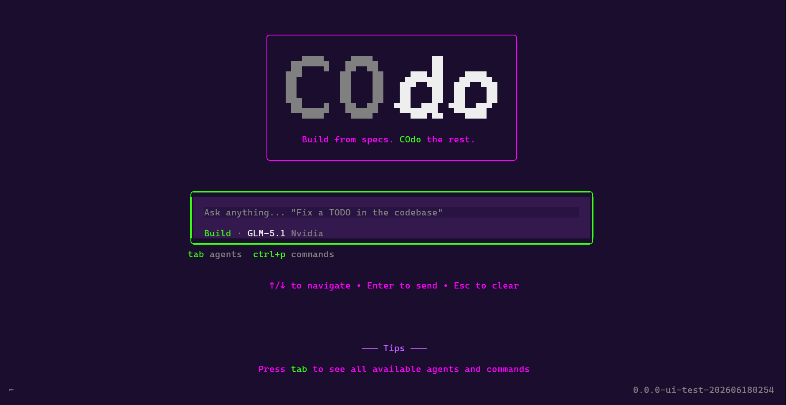

<div align="center">

# COdo

**A terminal-native AI coding assistant with structured, workflow-driven development.**

Your terminal asked for an AI assistant. We gave it a whole personality.

[](https://www.npmjs.com/package/@codo-ai/cli)
[](https://www.npmjs.com/package/@codo-ai/cli)
[](./LICENSE)
[](https://bun.sh)
[](https://github.com/anomalyco/opencode)

```bash
npm i -g @codo-ai/cli && codo
```

<br>



</div>

---

> No browser tab. No separate app. No context-switching. Just you, your terminal, and an AI that knows what phase of the project you're in.

Most AI coding tools give you a place to type questions. COdo gives you a **system** — different modes for different kinds of work, a goal anchor so nothing goes off-script, and a skills layer that keeps the agent focused on what actually matters right now.

---

## Table of Contents

- [Install](#install)
- [Workflows](#workflows)
  - [Powered by GSD Pi](#powered-by-gsd-pi)
- [Commands](#commands)
- [BYOK — Bring Your Own Key](#byok)
- [Skills System](#skills-system)
- [Themes](#themes)
- [VS Code Extension](#vs-code-extension)
- [Running Locally](#running-locally)
- [Contributing](#contributing)
- [Tech Stack](#tech-stack)
- [License](#license)

---

## Install

```bash
npm i -g @codo-ai/cli
```

Then in any terminal:

```bash
codo
```

No YAML config ritual. No 47-step setup guide. It just runs.

---

## Workflows

COdo's `/workflow` command is the core of the system. Pick a mode and the entire agent — its tools, skills, and behavior — adapts to match.

| Workflow | What it's for |
|---|---|
| **Vibe Mode** | Freeform, no rules. Great for side projects at 2am. |
| **GSD** *(Get Shit Done)* | Spec → milestones → phases → shipped. No detours. |
| **SpecKit** | GitHub's own spec-driven toolkit, baked in. |
| **GStack** | Garry Tan's 23-tool startup playbook. For when you mean business. |

When you switch workflows, `/skills` auto-filters to only show tools relevant to that mode. No "startup pitch deck" skill showing up while you're debugging a null pointer.

```
/workflow → "GSD" selected
              ↓
        COdo enters spec-driven mode
        /skills shows only GSD tools
        Agent follows your milestone plan
        You ship the thing
```

> [!TIP]
> Start with **GSD** when building from scratch. Set the spec, define the goal, and let COdo drive phase by phase.

### Powered by GSD Pi

The GSD workflow runs on [GSD Pi](https://github.com/open-gsd/gsd-pi) — a meta-prompting, context engineering, and spec-driven development system built to keep agents on track across long autonomous sessions.

GSD Pi handles the hard parts: breaking work into milestones, slices, and tasks; isolating implementation in Git worktrees; and tracking project state locally so the agent never loses the thread. COdo integrates this directly into the `/workflow` system so you get the full power of spec-driven development without leaving your terminal.

> [!NOTE]
> Want to use GSD Pi standalone or learn more about how it works under the hood? See the [GSD Pi repository](https://github.com/open-gsd/gsd-pi) and join the [GSD Discord community](https://discord.com/invite/nKXTsAcmbT).

---

## Commands

| Command | What it does |
|---|---|
| `/workflow` | Switch modes — GSD, SpecKit, GStack, or Vibe |
| `/goal` | Anchor every suggestion to a single objective |
| `/scraper` | Pull structured data from websites, legally |
| `/skills` | Browse tools available for your current workflow |

### `/goal`

Set this before anything else:

```
/goal Build a real-time notification system with WebSockets
```

Every suggestion, tool call, and line of code is now anchored to that. No drift. No surprise architecture rewrites halfway through.

### `/scraper`

```
/scraper get product listings from example.com/shop
```

Checks `robots.txt` and ToS before touching anything. Uses adaptive HTML parsing so it doesn't break when a site updates its CSS. If direct access is blocked, it generates a standalone Python script you can run locally.

---

## BYOK

COdo doesn't lock you into any AI provider. Plug in OpenAI, Anthropic, NVIDIA, or any OpenAI-compatible API. Switch models mid-project. Your workflow, your keys.

### Free API key — no credit card required

NVIDIA's NIM platform gives you free-tier access to production-quality models (Llama, Mistral, and more):

**https://build.nvidia.com/**

Once you have a key, add it to your config:

<details>
<summary>Config file location</summary>

- **Windows:** `C:\Users\<you>\.codo\config.json`
- **Mac/Linux:** `~/.codo/config.json`

</details>

```json
{
  "providers": {
    "nvidia": {
      "apiKey": "YOUR_NVIDIA_KEY_HERE"
    }
  }
}
```

---

## Skills System

Skills are markdown files that load into the agent's context when needed. Think of them as modular instructions — swappable, composable, and scoped to workflows.

**Where they live:**

| Path | Scope |
|---|---|
| `.opencode/skills/` | Project-specific, checked into your repo |
| `~/.codo/skills/` | Global, follows you across all projects |

Skills can be **workflow-specific** (only appear in the right mode) or **universal** (always available).

**Writing a skill:**

```markdown
---
name: my-skill
description: "Does the thing I always forget how to do"
compatibility: "OpenCode (with tools)"
---

# Instructions for the agent here
```

---

## Themes

35+ built-in themes. Your terminal should look good.

<details>
<summary>Browse all themes</summary>

| Taste | Themes |
|---|---|
| Dark & brooding | Dracula, AMOLED, One Dark, Cobalt2, Nightowl |
| Cozy & aesthetic | Catppuccin, Rose Pine, Aura, Tokyo Night, Palenight |
| Nature-coded | Everforest, Gruvbox, Nord, Kanagawa, Flexoki |
| Chaotic energy | Synthwave84, Matrix, Osaka Jade, Lucent Orange |
| Calm & minimal | Vesper, Zenburn, Mercury, GitHub, Solarized |

</details>

Includes a custom `codo` theme and all the classics.

---


## Running Locally

```bash
# Clone the repo
git clone https://github.com/anomalyco/opencode
cd opencode

# Start the dev server
cd packages/opencode
bun dev

# Type check
bun typecheck

# Run tests (from the package dir, not the root)
bun test
```

---

## Contributing

**Branches** — short, 2–3 words, hyphens only:

```
# Good
session-recovery
fix-scroll
workflow-filter

# Bad
feat/session-recovery
fix_scroll
iHopeThisWorks
```

**Commits** — conventional style:

```
feat(tui): add workflow selector
fix(core): resolve session timeout
docs: update README
```

> [!NOTE]
> The default branch is `dev`, not `main`.

---

## Tech Stack

| Layer | Technology |
|---|---|
| Runtime | Bun |
| UI Framework | Solid.js |
| Docs Site | Astro + Starlight |
| Database | SQLite via Drizzle ORM |
| Async System | Effect-TS |
| Terminal Layout | Yoga layout engine |
| AI Providers | Multi-provider (OpenAI, Anthropic, NVIDIA, etc.) |
| i18n | 17 languages |

<details>
<summary>Project structure</summary>

```
COdo/
├── packages/
│   ├── tui/                  # Terminal UI (Solid.js)
│   │   └── src/
│   │       ├── app.tsx
│   │       ├── component/
│   │       ├── theme/        # 35+ built-in themes
│   │       └── workflow/
│   └── web/                  # Docs site (Astro + Starlight)
│       └── src/
│           └── content/
│               └── docs/     # i18n docs (17 languages)
├── sdks/
│   └── vscode/               # VS Code extension
├── specs/                    # Architecture & feature specs
├── script/                   # Build, publish, release scripts
└── .opencode/
    ├── skills/               # Workspace-level skills
    ├── command/              # Custom commands
    └── agent/                # Custom agents
```

</details>

---

## License

COdo is an open-source fork of [OpenCode](https://github.com/anomalyco/opencode). See [LICENSE](./LICENSE) for details.

---

<div align="center">

*Built for developers who are tired of AI tools that feel like fancy autocomplete.*

</div>
