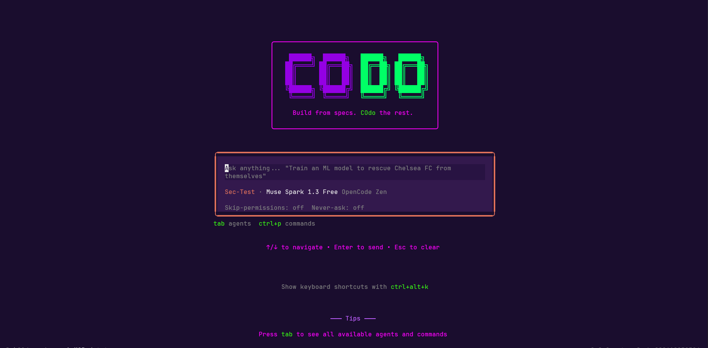

<div align="center">


# \>_ COdo

**The security-native AI coding agent.**

Spec it. Code it. Ship it. **Secure it.**

[Website](https://codo-ai.vercel.app/) · [Documentation](https://codo-ai.vercel.app/docs) · [GitHub](https://github.com/Mosalah4351/COdo) · [Report Issue](https://github.com/Mosalah4351/COdo/issues)

`npm install -g codo-ai`

[](LICENSE)
[](#)
[](https://www.npmjs.com/package/codo-ai)



</div>

---

## What is COdo?

COdo is a **terminal-native, spec-driven AI coding agent** — a fork of
[OpenCode](https://github.com/anomalyco/opencode) with structured workflow
orchestration, an autonomous multi-agent compose engine, and the all-new
**Sec-Test** security engine.

No browser tab. No separate app. No context-switching. Just you, your terminal,
and an AI that knows what phase of the project you're in.

```
$ npm install -g codo-ai
$ cd my-project
$ codo
```

Most AI coding tools give you a place to type questions. COdo gives you a
**system** — different modes for different kinds of work, a goal anchor so
nothing goes off-script, and a skills layer that keeps the agent focused on
what actually matters right now.

## Why COdo?

Your linter found 400 warnings and fixed zero of them. Your CI scanner told you
about the vulnerability three weeks after you shipped it. COdo sits where you
work, finds the flaw *before* the code exists, and hands you the fix — with
proof.

| | Static linters | CI scanners | **COdo Sec-Test** |
|---|---|---|---|
| Finds design flaws pre-code | ✗ | ✗ | ✓ STRIDE threat modeling |
| Noise level | False-positive flood | Late-stage flood | Evidence-first findings w/ PoC |
| Runs where you work | ✗ | CI only | ✓ Your terminal |
| Fixes vulnerabilities | Warnings only | Warnings only | ✓ Remediation diffs + mutation-backed tests |

## Highlights

### Sec-Test — Autonomous Security Orchestrator

Six specialist personas guarding the full lifecycle. One dispatcher routes your
request; each persona does exactly one job and does it ruthlessly:

| Persona | Role |
|---|---|
| **Security Architect** | Pre-code STRIDE/DREAD threat modeling (OWASP ASVS mapped) |
| **AppSec Engineer** | Real-time SAST on diffs — OWASP Top 10:2025 / CWE Top 25, secrets, CVEs |
| **DevSecOps Engineer** | Pipeline hardening (NIST SSDF), SBOM (CycloneDX/SPDX), SLSA + Sigstore |
| **Penetration Tester** | Scope-gated live probing (PTES/WSTG) — refuses targets outside `.codo/security-scope.json` |
| **Quality Engineer** | Adversarial tests verified by mutation kill-rate |
| **Security Engineer** | Audits the agent itself; posture drift tracking |

```bash
$ /sec-test "Audit git diff for SQL injection and hardcoded secrets"
[1] Raw string concatenation in query builder
[2] Hardcoded fallback JWT secret ("dev-secret-key-12345")
→ Parameterized query fix applied · secret moved to env with startup validation
```

Every finding gets an ID, a severity, evidence, and a remediation path — stored
durably, never lost in markdown notes.

### Workflow Engines

Switch methodology per project scale, not per religion:

- `/workflow gsd` — autonomous milestone planning, persistent `.planning/` state, survives context resets
- `/workflow gstack` — Garry Tan's 23-role virtual engineering team
- `/workflow speckit` — GitHub SDD spec-first pipeline
- `/workflow vibemode` — pure flow, zero overhead

### Multi-Agent Compose

Complex tasks decompose into DAGs routed to specialist agents executing in
parallel waves:

```
/compose "Build auth service with JWT, rate limiting & Sec-Test"
  [A] Security Architect → threat model        ┐ parallel
  [B] Builder            → implementation       ├ wave
  [C] AppSec Engineer    → real-time SAST audit │
  [D] Quality Engineer   → mutation tests       ┘
```

### Goal Judge

Declare outcomes, not tasks. An independent judge model verifies
stop-conditions — the builder never self-approves.

```
/goal "All tests pass with >80% coverage and zero HIGH/CVEs"
```

### Business Suite

Yes, your coding agent does expense reports too. Production-grade office
tooling as skills: `xlsx-official`, `docx-official`, `pptx-official`,
`pdf-official`, `deep-research`, `super-research`, `research-paper-writing`,
`html-to-video-pipeline`, `sales`. Research it, spreadsheet it, deck it, ship
the PDF — without leaving the terminal.

### Compliance-First Scraper

`/scraper <url> <what to extract>` — robots.txt honored, ToS checked,
crawl-delays enforced, escalation ladder from static fetch to authenticated
sessions. It asks permission before it knocks; most scrapers just knock.

## Use any model

75+ LLM providers through [Models.dev](https://models.dev), including local
models. Prefer your existing subscriptions? Log in with GitHub to use your
Copilot account, or with OpenAI for ChatGPT Plus/Pro. New to providers? Run
`/connect` and try [COdo Zen](https://codo-ai.vercel.app/docs/zen) — models
tested and verified by the COdo team.

## Everywhere you work

- **Native TUI** — responsive, themeable terminal UI (35+ themes).
- **Desktop app & VS Code extension** — same agent, your preferred surface.
- **LSP enabled** — automatically loads the right language servers for the LLM.
- **Multi-session** — parallel agents on the same project.
- **Shareable links** — send any session for reference or debugging.

## Install

```bash
# Recommended
npm install -g codo-ai

# One-time run
npx codo-ai
```

Requirements: Node 18+ or Bun · macOS / Linux / Windows · any provider API key
(Anthropic, OpenAI, NVIDIA free tier, Google, or OpenAI-compatible).

> Migrating from `@codo-ai/cli`? That package is deprecated — `codo-ai` replaces it.

## Documentation

Full developer docs — every persona, skill, workflow, permission mode, and best
practice — live at **[codo-ai.vercel.app](https://codo-ai.vercel.app/)**.

## Contributing

PRs welcome on [GitHub](https://github.com/Mosalah4351/COdo). Default branch:
`main`. Conventional commits (`feat/fix/docs/chore/refactor/test`).

## License

MIT © [Mohamed Salah](https://www.linkedin.com/in/mohamed-salah-59bb41300/)

Built on [OpenCode](https://github.com/anomalyco/opencode).

## Contributors

- **COdo agent** — AI contributor (session title generation, Muse prompt restore, release tooling). Commits carry a `Co-Authored-By: COdo agent` trailer.

## Community

- **Issues** — <https://github.com/Mosalah4351/COdo/issues>
- **Discussions** — <https://github.com/Mosalah4351/COdo/discussions>
- **Docs** — <https://codo-ai.vercel.app/docs>

If you find a vulnerability in COdo, please do **not** open a public issue — email
`security@codo.run` with a proof-of-concept.
