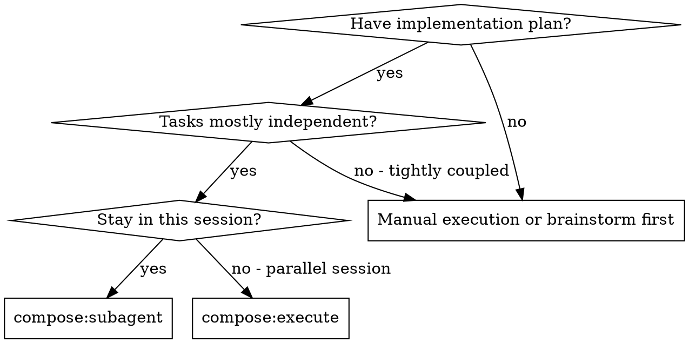

# Subagent-Driven Development

Execute plan by dispatching fresh subagent per task, with two-stage review after each: spec compliance review first, then code quality review.

**Why subagents:** You delegate tasks to specialized agents with isolated context. By precisely crafting their instructions and context, you ensure they stay focused and succeed at their task. They should never inherit your session's context or history — you construct exactly what they need. This also preserves your own context for coordination work.

**Core principle:** Fresh subagent per task + two-stage review (spec then quality) = high quality, fast iteration

**Continuous execution:** Do not pause to check in with your human partner between tasks. Execute all tasks from the plan without stopping. The only reasons to stop are: BLOCKED status you cannot resolve, ambiguity that genuinely prevents progress, or all tasks complete. When you must stop for ambiguity or a blocker, use `compose:ask` to present the situation with structured options. If no user is available, resolve it with your best judgment and continue.

## When to Use

## The Process

### 1. Read Plan and Extract Tasks

Read plan file once, extract all tasks with full text and context, create a task per plan task.

### 2. Per Task: Dispatch Implementer

- Create and bind a task before dispatching
- Inject covered spec sections as Intent
- Dispatch implementer with full task text + context

### 3. Per Task: Two-Stage Review

**Phase 1:** Dispatch spec reviewer with covered spec section text + `git diff` ONLY. Do NOT include the implementer's report.

**Phase 2:** Only if phase 1 flagged anything. Re-dispatch with phase-1 verdict + implementer's report.

### 4. Per Task: Code Quality Review

After spec compliance passes, dispatch code quality reviewer.

### 5. Mark Task Done

Only when both spec compliance AND code quality reviews pass.

### 6. Repeat for All Tasks

### 7. Final Review

After all tasks, dispatch final code reviewer for entire implementation.

### 8. Merge

Use compose:merge to complete development.

## Model Selection

Use the least powerful model that can handle each role to conserve cost and increase speed.

**Mechanical implementation tasks** (isolated functions, clear specs, 1-2 files): use a fast, cheap model.

**Integration and judgment tasks** (multi-file coordination, pattern matching, debugging): use a standard model.

**Architecture, design, and review tasks**: use the most capable available model.

## Handling Implementer Status

**DONE:** Proceed to spec compliance review.

**DONE_WITH_CONCERNS:** Read the concerns before proceeding. If about correctness or scope, address them before review.

**NEEDS_CONTEXT:** Provide the missing context and re-dispatch.

**BLOCKED:** Assess the blocker:
1. If context problem, provide more context and re-dispatch
2. If requires more reasoning, re-dispatch with more capable model
3. If too large, break into smaller pieces
4. If plan itself is wrong, escalate to the human

## Advantages

**vs. Manual execution:**
- Subagents follow TDD naturally
- Fresh context per task (no confusion)
- Parallel-safe (subagents don't interfere)

**vs. Executing Plans:**
- Same session (no handoff)
- Continuous progress (no waiting)
- Review checkpoints automatic

**Quality gates:**
- Self-review catches issues before handoff
- Two-stage review: spec compliance, then code quality
- Spec compliance prevents over/under-building

## Red Flags

**Never:**
- Start implementation on main/master branch without explicit user consent
- Skip reviews (spec compliance OR code quality)
- Proceed with unfixed issues
- Dispatch multiple implementation subagents in parallel (conflicts)
- Make subagent read plan file (provide full text instead)
- Skip scene-setting context
- Ignore subagent questions
- Accept "close enough" on spec compliance
- Start code quality review before spec compliance passes
- Mark a task complete while any in-scope claim is `fail` or `unverifiable`

## Important: Passing Skills to Subagents

Compose skills do NOT appear in subagents' `available_skills` list. When a subagent needs to use a skill, pass the relevant `<compose_skills>` block (or subset) directly in the subagent's prompt. Include this note alongside the block: "The skills listed in <compose_skills> are NOT in your available_skills — this is by design. You can invoke them by name using the skill tool, or read the SKILL.md at the location path."

## Integration

**Required workflow skills:**
- **compose:worktree** - Ensures isolated workspace
- **compose:plan** - Creates the plan this skill executes
- **compose:review** - Code review template for reviewer subagents
- **compose:merge** - Complete development after all tasks

**Subagents should use:**
- **compose:tdd** - Subagents follow TDD for each task
