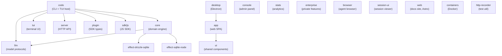

# COdo — Complete Project Walkthrough

**COdo** is an **AI-powered coding assistant** that runs directly in your terminal as a TUI (Terminal User Interface). It's a monorepo built with **Bun**, **TypeScript**, **Effect-TS**, **Solid.js**, and **Drizzle ORM** on SQLite. The project uses **Turborepo** for task orchestration and **SST (Serverless Stack)** for cloud infrastructure on Cloudflare + AWS.

---

## 1. Repository Root

| File/Dir | Purpose |
|---|---|
| [package.json](file:///d:/COdo/package.json) | Bun workspace root. Declares 27+ workspace packages, a version catalog for pinned deps, scripts (`dev`, `build`, `typecheck`, etc.), and overrides/patches. **Name**: `codo`, **Package manager**: `bun@1.3.13`. |
| [turbo.json](file:///d:/COdo/turbo.json) | Turborepo config for `typecheck`, `build`, and per-package test tasks. |
| [bunfig.toml](file:///d:/COdo/bunfig.toml) | Bun install settings — exact versions, 3-day minimum release age (with exclusions for fast-moving deps). **Test root guard** prevents running tests from repo root. |
| [tsconfig.json](file:///d:/COdo/tsconfig.json) | Extends `@tsconfig/bun`. |
| [sst.config.ts](file:///d:/COdo/sst.config.ts) | SST v4 config — app name `codo`, Cloudflare home, AWS (us-east-1), Stripe, PlanetScale, Honeycomb providers. Imports infra modules for API, console, lake, stats, monitoring, enterprise. |
| [AGENTS.md](file:///d:/COdo/AGENTS.md) | Global coding rules — branch naming, commit style, style guide (no `any`, no star imports, no destructuring, `const` over `let`, early returns, Drizzle snake_case), testing rules, V2 Session Core invariants. |
| `flake.nix` / `flake.lock` | Nix flake for reproducible dev environments. |
| `.oxlintrc.json` | Oxlint linter configuration. |
| `install` | Shell installer script (14KB). |

---

## 2. Packages Overview (27 packages)



---

## 3. Package Deep Dives

### 3.1 `packages/core` — Domain Engine

> [!IMPORTANT]
> This is the **heart of COdo**. Contains all domain logic: sessions, events, tools, providers, models, plugins, agents, permissions, config, git, filesystem, and more.

**Key modules** (79 source files + 29 directories in `src/`):

| Module | Files | Description |
|---|---|---|
| **Session** (`session/`) | 21 files + `runner/`, `execution/` | V2 durable sessions with event-sourced state. `SessionV2.prompt()` admits inputs, `SessionExecution` coordinates drains, `SessionRunner` handles model turns. Includes projector, compaction, context epochs, history, message updater. |
| **Event** (`event.ts` + `event/`) | 681 lines | Event-sourced aggregate system. `EventV2.define()` creates typed durable events. `publish()` writes to SQLite in transactions, projects synchronously, then notifies PubSub subscribers. Supports `replay()` / `replayAll()` for sync. |
| **Tool** (`tool/`) | 19 files | Built-in tools: `bash`, `read`, `write`, `edit`, `apply-patch`, `grep`, `glob`, `webfetch`, `websearch`, `question`, `skill`, `todowrite`. Each has a `.ts` implementation and `.txt` description. Registry manages tool discovery. |
| **Config** (`config.ts` + `config/`) | 14 sub-configs | Hierarchical JSONC config loading. Searches up from CWD through `.COdo`/`.opencode` dirs to global. Sub-configs for agent, MCP, LSP, provider, plugin, attachments, compaction, commands, formatter, watcher, etc. |
| **Catalog** (`catalog.ts`) | 354 lines | Provider + model catalog with credential projection. Immer-based state with `transform`/`mutate` API. Handles default model selection, small model heuristics, provider policy. |
| **Agent** (`agent.ts`) | 143 lines | Agent registry. Agents have id, model, system prompt, mode (primary/subagent/all), color, permissions. Default agent is `build`. |
| **Plugin** (`plugin.ts` + `plugin/`) | Plugin system with lifecycle hooks (`catalog.transform`, `aisdk.language`, `aisdk.sdk`). Hot-reloadable with scoped cleanup. |
| **System Context** (`system-context/`) | 317 lines | Typed, independently refreshable system context sources. Sources produce `baseline`/`update`/`removed` text. Snapshots are durable for change detection across turns. |
| **Permission** (`permission.ts` + `permission/`) | Permission system with ask/allow/deny rules per tool. |
| **Database** (`database/`) | SQLite via Drizzle ORM. Separate Bun/Node adapters (`#sqlite` import). Migration system. Schema in `*.sql.ts` files. |
| **Project** (`project/`) | Project detection, copy strategies, directory resolution. |
| **Provider** (`provider.ts`) | Provider model (ID, api config, request headers/body, enabled state). |
| **Model** (`model.ts`) | Model schema (ID, providerID, capabilities, cost, status, release time). |
| **Git** (`git.ts`) | Git operations (17KB) — diff, status, log, worktree. |
| **Filesystem** (`filesystem/`) | File search, ignore patterns, protected paths, watcher, FFF (fast file finder) with Bun/Node adapters. |
| **Ripgrep** (`ripgrep/`) | Ripgrep binary integration for code search. |
| **Integration** (`integration.ts`) | 20KB — integration connection management. |
| **Credential** (`credential.ts`) | Secure credential storage. |
| **Process** (`process.ts`) | Process spawning and management (9KB). |
| **PTY** (`pty.ts` + `pty/`) | Pseudo-terminal for shell tool. Bun/Node adapters. |
| **Skill** (`skill/`) | Skill discovery and loading from markdown files. |
| **Share** (`share/`) | Session sharing functionality. |
| **Image** (`image.ts`) | Image processing (photon-node). |
| **Observability** (`observability/`) | OpenTelemetry tracing integration. |

---

### 3.2 `packages/codo` — Main CLI + Session Orchestration

> The main binary. Hosts the CLI (yargs), the HTTP server, session orchestration, provider transforms, tool registry, and the TUI host.

**Entry point**: [src/index.ts](file:///d:/COdo/packages/codo/src/index.ts) — yargs CLI with 24+ commands:

| Command | Description |
|---|---|
| *(default)* | Launch TUI |
| `run` | Non-interactive run |
| `serve` | Start HTTP server only |
| `generate` | Code generation |
| `providers` | Manage AI providers |
| `models` | List models |
| `agent` | Agent management |
| `mcp` | MCP server management |
| `acp` | Agent Client Protocol |
| `github` | GitHub integration |
| `pr` | Pull request management |
| `web` | Open web UI |
| `export` / `import` | Session export/import |
| `stats` | Usage statistics |
| `session` | Session management |
| `plugin` | Plugin management |
| `browser` | Browser agent |
| `upgrade` / `uninstall` | Self-management |
| `db` | Database management |
| `attach` | Attach to running session |
| `debug` | Debug utilities |

**Key directories:**

- **`src/session/`** (23 files) — Session orchestration layer. `prompt.ts` (75KB!) is the massive prompt construction engine. `processor.ts` (44KB) handles the model loop. `session.ts` (40KB) manages session lifecycle. Also: compaction, goals, retry, revert, LLM integration, message formatting.
- **`src/tool/`** (39 files) — Tool implementations with `.ts` code + `.txt` descriptions. Tools: read, write, edit, apply_patch, grep, glob, shell, webfetch, websearch, question, skill, task, plan, todo, lsp, truncation.
- **`src/provider/`** (5 files) — Provider setup. `provider.ts` (76KB!) is the massive provider configuration with all AI SDK integrations. `transform.ts` (52KB) handles provider transformations.
- **`src/mcp/`** (5 files) — MCP (Model Context Protocol) integration (35KB index). OAuth provider/callback handling.
- **`src/agent/`** — Agent definitions with system prompts.
- **`src/config/`** (14 files) — Configuration management including TUI config, variables, plugins, managed config.
- **`src/server/`** — HTTP server (Hono-based) with routes, auth, CORS, mDNS discovery, TUI events.
- **`src/cli/`** — CLI commands, effect runner, error formatting, upgrade logic.
- **`src/acp/`** (12 files) — Agent Client Protocol implementation (38KB service).
- **`src/sync/`** — Session synchronization.
- **`src/worktree/`** — Git worktree management (24KB).
- **`src/snapshot/`** — Undo/revert snapshots (34KB).

---

### 3.3 `packages/llm` — LLM Abstraction Layer

> Protocol-agnostic LLM client with multi-provider support.

**Core files:**

| File | Size | Description |
|---|---|---|
| `llm.ts` | 6KB | High-level API: `stream()`, `generate()`, `generateObject()`, `request()`. |
| `tool.ts` | 10KB | Tool definition + runtime for LLM tool calls. |
| `provider.ts` | 1.3KB | Provider interface. |
| `cache-policy.ts` | 6KB | Response caching. |

**Providers** (`providers/`, 13 files): Amazon Bedrock, Anthropic, Azure, Cloudflare, GitHub Copilot, Google, OpenAI, OpenAI-Compatible, OpenAI-Compatible-Profile, OpenRouter, xAI.

**Protocols** (`protocols/`, 9 files): Anthropic Messages (34KB), Bedrock Converse (24KB), Gemini (18KB), OpenAI Chat (20KB), OpenAI Compatible Chat, OpenAI Responses (40KB). These are the raw HTTP protocol implementations for each provider API.

**Route** (`route/`): HTTP client and routing for LLM requests.

---

### 3.4 `packages/tui` — Terminal User Interface

> Built with **Solid.js** + **@opentui/solid** (custom terminal rendering framework).

- [app.tsx](file:///d:/COdo/packages/tui/src/app.tsx) — 40KB main TUI application
- **Components** (`component/`, 32 files): Dialogs for agent, model, MCP, provider, session, workspace, retry, stash, theme, variant. Plus: command palette, logo (28KB animated!), spinner, prompt input, background pulse.
- **Routes** (`routes/`) — TUI navigation
- **Theme** (`theme/`) — Terminal color themes
- **Keymap** (`keymap.tsx`) — Keyboard shortcut bindings
- **Workflow** (`workflow/`) — Workflow system (Vibe, GSD, SpecKit, GStack)
- **Parsers** (`parsers-config.ts`) — 16KB of tree-sitter parser configurations

---

### 3.5 `packages/app` — Web Application

> **Solid.js** SPA with Vite. Provides web-based UI alternative to the TUI.

- Uses `@solidjs/router` and `@solidjs/start`
- Tailwind CSS v4 for styling
- Components, hooks, context, i18n, pages, addons
- Desktop menu integration
- WSL support
- Playwright e2e tests

---

### 3.6 `packages/desktop` — Electron Desktop App

> Wraps the web app in Electron for native desktop experience.

- `src/main/` — Electron main process
- `src/preload/` — Preload scripts
- `src/renderer/` — Renderer process
- `electron-builder.config.ts` — Build configuration (4.5KB)
- Icons and resources for all platforms

---

### 3.7 `packages/server` — HTTP API Server

> **Hono**-based REST API with 17 route groups.

| Route Group | Description |
|---|---|
| `session.ts` | Session CRUD, prompt, events, interrupt |
| `message.ts` | Message listing, single message |
| `model.ts` | Model listing |
| `provider.ts` | Provider management |
| `agent.ts` | Agent listing |
| `credential.ts` | Credential management |
| `event.ts` | Event streaming |
| `fs.ts` | Filesystem operations |
| `health.ts` | Health check |
| `integration.ts` | Integration management |
| `location.ts` | Location/workspace management |
| `permission.ts` | Permission management |
| `project-copy.ts` | Project copy operations |
| `question.ts` | User question/answer |
| `reference.ts` | External reference management |
| `skill.ts` | Skill listing |
| `command.ts` | Command execution |

---

### 3.8 `packages/plugin` — Plugin SDK

> Type definitions and utilities for building COdo plugins.

- `index.ts` (9KB) — Plugin interface, hook definitions, auth hooks, workspace adapters
- `tool.ts` — Tool definition types
- `shell.ts` — BunShell integration
- `tui.ts` (18KB) — TUI plugin extensions

**Plugin Hooks** (30+ hooks): `config`, `event`, `tool`, `auth`, `provider`, `chat.message`, `chat.params`, `chat.headers`, `permission.ask`, `command.execute.before`, `tool.execute.before`, `tool.execute.after`, `shell.env`, `experimental.chat.messages.transform`, `experimental.chat.system.transform`, `experimental.session.compacting`, `experimental.compaction.autocontinue`, `experimental.text.complete`, `tool.definition`.

---

### 3.9 `packages/sdk/js` — JavaScript SDK

> Auto-generated TypeScript SDK from OpenAPI spec (`openapi.json`, 891KB).

---

### 3.10 `packages/ui` — Shared UI Components

> Solid.js component library shared between web app and other frontends.

- Components, hooks, context, themes
- i18n internationalization
- Pierre diffs integration
- Storybook stories
- V2 components

---

### 3.11 `packages/browser` — Browser Agent

> Agent-controlled browser for web automation.

- `agent-browser.ts` — Browser automation agent
- `tools/` — Browser-specific tools
- `daemon.ts` — Browser daemon process
- `config.ts` — Browser configuration

---

### 3.12 Other Packages

| Package | Description |
|---|---|
| `packages/session-ui` | Session viewer component |
| `packages/console` | Admin console (app + core + function + mail + resource + support) |
| `packages/stats` | Analytics dashboard (app + core + server) |
| `packages/enterprise` | Enterprise features |
| `packages/identity` | Identity/branding assets (SVG marks, PNGs) |
| `packages/web` | Documentation site (Astro) |
| `packages/docs` | Mintlify documentation content |
| `packages/storybook` | Component storybook |
| `packages/containers` | Docker container definitions (base, bun-node, rust, tauri-linux, build, publish) |
| `packages/cli` | Standalone CLI package |
| `packages/function` | Cloudflare Workers serverless functions |
| `packages/effect-drizzle-sqlite` | Effect wrapper for Drizzle + SQLite |
| `packages/effect-sqlite-node` | Effect wrapper for SQLite on Node |
| `packages/http-recorder` | HTTP request/response recorder for testing |
| `packages/script` | Shared build scripts |
| `packages/slack` | Slack integration |

---

## 4. Infrastructure (`infra/`)

| File | Description |
|---|---|
| `stage.ts` | Stage config: `production` → `opencode.ai`, `dev` → `dev.opencode.ai` |
| `app.ts` | Cloudflare Worker API (`api.{domain}`), Astro docs site (`docs.{domain}`), static web app (`app.{domain}`). Secrets: GitHub App, EmailOctopus, Discord, Feishu, Admin. |
| `console.ts` | Admin console infrastructure (10KB) |
| `lake.ts` | Data lake infrastructure (10KB) — AWS-based analytics ingestion |
| `stats.ts` | Stats infrastructure (8KB) |
| `monitoring.ts` | Production monitoring (8KB) — Honeycomb, alerting |
| `enterprise.ts` | Enterprise deployment config |
| `secret.ts` | Secret management |

---

## 5. Architecture Patterns

### 5.1 Effect-TS Service Pattern

Every domain module follows this pattern:

```ts
// Self-reexport at top
export * as MyModule from "./my-module"

// Schema types
export class Info extends Schema.Class<Info>("MyModule.Info")({ ... }) {}

// Service interface
export interface Interface {
  readonly method: (input: Input) => Effect.Effect<Output, Error>
}

// Service tag
export class Service extends Context.Service<Service, Interface>()("@codo/MyModule") {}

// Layer construction
export const layer = Layer.effect(Service, Effect.gen(function* () { ... }))

// Default composed layer
export const defaultLayer = layer.pipe(Layer.provide(...))
```

### 5.2 Event Sourcing

Sessions are fully event-sourced:
1. Events defined with `EventV2.define()` — typed, versioned, with sync support
2. Published atomically inside SQLite transactions
3. Projectors run synchronously within the transaction
4. PubSub notifies listeners after commit
5. Replay supports sync across devices

### 5.3 State Management (Immer)

Catalog, Agent, and other registries use `State.create<Data, Editor>()`:
- Immer-based immutable state with draft mutation API
- `transform()` for batch mutations
- `finalize()` hook for post-mutation logic (e.g., plugin triggers, policy evaluation)

### 5.4 Location Scoping

Services are scoped to a **Location** (directory + optional workspace ID):
- `Location.Service` provides the current directory context
- Config, tools, permissions, model resolution are all location-scoped
- Multiple locations can run concurrently (different sessions)

### 5.5 V2 Session Lifecycle

```
User Input → SessionV2.prompt() → Admit durable session_input row
                                    → SessionExecution.wake(sessionID)
                                    → SessionRunCoordinator joins/coalesces
                                    → SessionRunner loads history + tools
                                    → llm.stream(request) — one call per provider turn
                                    → Tool execution → results stored
                                    → Events published → Projectors update state
```

---

## 6. Technology Summary

| Layer | Technology |
|---|---|
| **Runtime** | Bun 1.3.13 |
| **Language** | TypeScript 5.8.2 + tsgo (native preview) |
| **Effect System** | Effect 4.0.0-beta.74 |
| **TUI Framework** | @opentui/solid 0.3.4 + Solid.js 1.9.10 |
| **Web Framework** | Solid.js + Vite 7.1.4 + Tailwind 4.1.11 |
| **Desktop** | Electron |
| **HTTP Server** | Hono 4.10.7 |
| **Database** | SQLite via Drizzle ORM 1.0.0-rc.2 |
| **AI SDK** | Vercel AI SDK 6.0.168 with 20+ provider integrations |
| **Monorepo** | Turborepo 2.8.13 |
| **Infrastructure** | SST 4.13.1 (Cloudflare + AWS) |
| **Linting** | Oxlint 1.60.0 |
| **Testing** | Bun test + Playwright 1.59.1 |
| **Observability** | OpenTelemetry + Honeycomb |

---

## 7. Key File Size Reference

These are the largest and most complex files in the codebase:

| File | Size | Description |
|---|---|---|
| `codo/src/provider/provider.ts` | 76KB | All AI provider configurations |
| `codo/src/session/prompt.ts` | 75KB | Prompt construction engine |
| `codo/src/provider/transform.ts` | 52KB | Provider transformations |
| `codo/src/session/processor.ts` | 44KB | Model loop processor |
| `codo/src/session/session.ts` | 40KB | Session lifecycle |
| `llm/src/protocols/openai-responses.ts` | 40KB | OpenAI Responses protocol |
| `tui/src/app.tsx` | 40KB | TUI main application |
| `codo/src/acp/service.ts` | 38KB | ACP service |
| `codo/src/mcp/index.ts` | 35KB | MCP integration |
| `llm/src/protocols/anthropic-messages.ts` | 34KB | Anthropic protocol |
| `codo/src/snapshot/index.ts` | 34KB | Snapshot system |
| `codo/src/config/config.ts` | 28KB | Config management |
| `tui/src/component/logo.tsx` | 28KB | Animated terminal logo |
| `core/src/event.ts` | 28KB | Event system |
| `codo/src/session/message-v2.ts` | 27KB | V2 message formatting |
| `codo/src/tool/edit.ts` | 25KB | Edit tool |
| `llm/src/protocols/bedrock-converse.ts` | 24KB | Bedrock protocol |
| `codo/src/worktree/index.ts` | 24KB | Worktree management |

---

## 8. Development Commands

```bash
# Run TUI (dev mode)
bun dev                           # from repo root
bun run --cwd packages/codo dev   # explicit

# Type check
bun turbo typecheck               # all packages
bun typecheck                     # from package dir (uses tsgo)

# Test (NEVER from root)
cd packages/codo && bun test
cd packages/core && bun test

# Build
bun run --cwd packages/codo build

# Desktop dev
bun --cwd packages/desktop dev

# Web app dev
bun --cwd packages/app dev

# Regenerate JS SDK
./packages/sdk/js/script/build.ts

# Lint
oxlint
```
